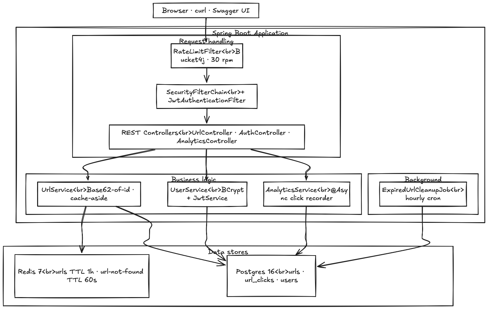
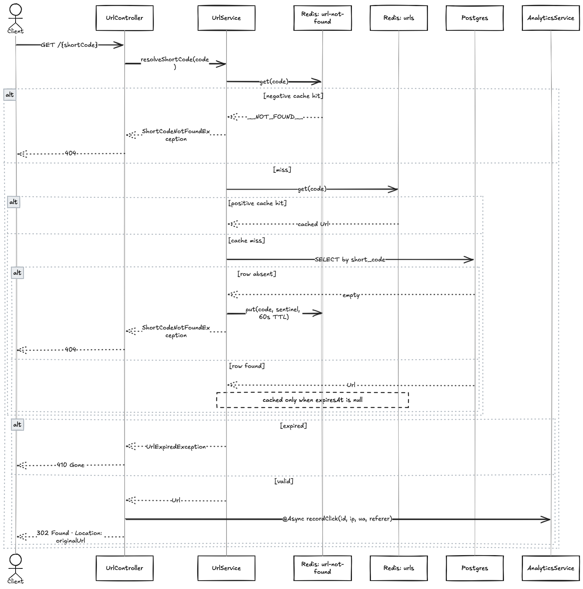

# URL Shortener

A Spring Boot 3.5.14 / Java 17 URL shortener with Base62 short codes, JWT auth, Redis cache-aside, per-IP rate limiting, async click analytics, and scheduled cleanup of expired links.

## Quick start

From the project root, start the full stack with Docker Compose:

```bash
docker compose up --build
```

Then open:

- App / static UI: <http://localhost:8080>
- Swagger UI: <http://localhost:8080/swagger-ui.html>
- OpenAPI JSON: <http://localhost:8080/v3/api-docs>

Tear everything down, including volumes, with:

```bash
docker compose down -v
```

## Architecture

### Architecture Diagram



### URL Flow



Three containers run side-by-side under `docker compose`:

- `app` - the Spring Boot service, exposed on host port `8080`.
- `postgres` - Postgres 16 with a named volume `pgdata`; the app waits for `pg_isready` before starting.
- `redis` - Redis 7 with a named volume `redisdata`, used for cache-aside URL lookups and negative caching for unknown short codes.

## Endpoints

| Method | Path                  | Auth     | Description                                      | Sample curl |
|--------|-----------------------|----------|--------------------------------------------------|-------------|
| POST   | `/api/auth/register`  | none     | Create a user account.                           | `curl -X POST http://localhost:8080/api/auth/register -H 'Content-Type: application/json' -d '{"username":"alice","email":"alice@example.com","password":"s3cret!!"}'` |
| POST   | `/api/auth/login`     | none     | Exchange credentials for a JWT.                  | `curl -X POST http://localhost:8080/api/auth/login -H 'Content-Type: application/json' -d '{"username":"alice","password":"s3cret!!"}'` |
| POST   | `/api/shorten`        | optional | Shorten a URL. Authenticated calls own the URL.  | `curl -X POST http://localhost:8080/api/shorten -H 'Content-Type: application/json' -d '{"url":"https://example.com/long/path","customAlias":"my-link"}'` |
| GET    | `/{shortCode}`        | none     | Redirect to the original URL; `410` if expired.  | `curl -i http://localhost:8080/my-link` |
| GET    | `/api/url/{id}`       | none     | Fetch URL metadata by id.                        | `curl http://localhost:8080/api/url/1` |
| DELETE | `/api/url/{id}`       | none     | Delete a URL by id.                              | `curl -X DELETE http://localhost:8080/api/url/1` |
| GET    | `/api/url/{id}/stats` | none     | Click totals and top user agents.                | `curl http://localhost:8080/api/url/1/stats` |
| GET    | `/api/me/urls`        | required | List URLs owned by the current user.             | `curl http://localhost:8080/api/me/urls -H "Authorization: Bearer $TOKEN"` |
| GET    | `/swagger-ui.html`    | none     | Interactive API explorer.                        | open in a browser |

Rate limits return `429 Too Many Requests` with a `Retry-After` header.

## Configuration Matrix

All values are read from environment variables with the defaults shown below in `src/main/resources/application.properties`. The compose file sets the values that need to differ inside the container network: `DB_URL`, `REDIS_HOST`, and `APP_JWT_SECRET`.

| Env var                    | Default                                                              | Purpose                                               |
|----------------------------|----------------------------------------------------------------------|-------------------------------------------------------|
| `SERVER_PORT`              | `8080`                                                               | HTTP port the app listens on.                         |
| `DB_URL`                   | `jdbc:postgresql://localhost:5432/url_shortener`                     | JDBC URL for Postgres.                                |
| `DB_USERNAME`              | `postgres`                                                           | Postgres user.                                        |
| `DB_PASSWORD`              | `postgres`                                                           | Postgres password.                                    |
| `APP_BASE_URL`             | `http://localhost:8080`                                              | Base URL used when building `shortUrl` in responses.  |
| `APP_JWT_SECRET`           | dev placeholder, at least 256 bits                                   | HMAC secret for signing JWTs. Override in production. |
| `APP_JWT_EXPIRATION_MS`    | `3600000`                                                            | JWT lifetime in milliseconds.                         |
| `APP_RATELIMIT_PUBLIC_RPM` | `30`                                                                 | Requests per minute for anonymous callers.            |
| `APP_RATELIMIT_AUTH_RPM`   | `200`                                                                | Requests per minute for authenticated callers.        |
| `REDIS_HOST`               | `localhost`                                                          | Redis hostname.                                       |
| `REDIS_PORT`               | `6379`                                                               | Redis port.                                           |

## Tech Stack

- Spring Boot 3.5.14 (Web, Data JPA, Security, Cache, Validation)
- Java 17
- PostgreSQL 16
- Redis 7
- Bucket4j for token-bucket rate limiting
- JJWT 0.12.x for JWT issuance and validation
- Spring Security
- Lombok
- springdoc-openapi for Swagger UI
